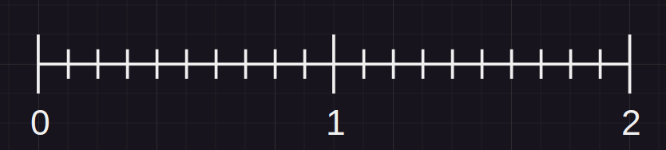
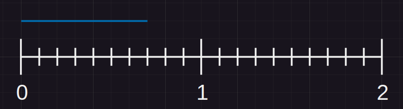
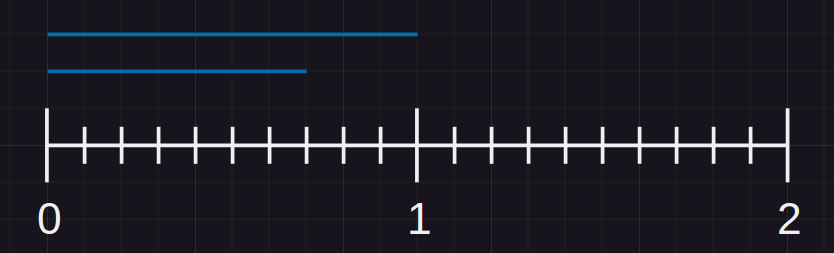
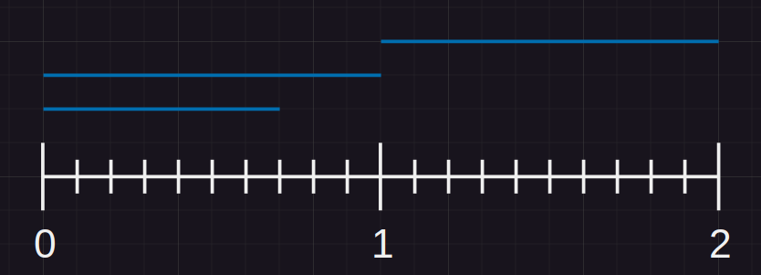

# Raindrops

You have 1 dimension tray you want to fill with raindrops, count and return how many raindrops it took to fill the tray. 
Raindrops fall on a single point on the tray and spill 0.5 to each side. 
Raindrops fall randomly on the tray as float/double without unknown amount of digits beyond the decimal dot. 
On collusion of raindrops, meaning, there is already water in that point, it stacks, it doesn't overflow.  
For the example lets say the size of the tray is 2, for the question please solve it with size N. 
 
A raindrop falls on 0.2: 
 
Because you can't go beyond the tray ignore spillage outside the boundary, so it will fill from 0 to 0.7 
A raindrop falls on 0.5: 
 
Now we have the tray with water from 0 to 1, any raindrop that will full and not spill over to between 1 to 2 won't change anymore 
A raindrop falls on 1.5: 
 
The result should be 3 because it took 3 raindrops to fill the whole tray.